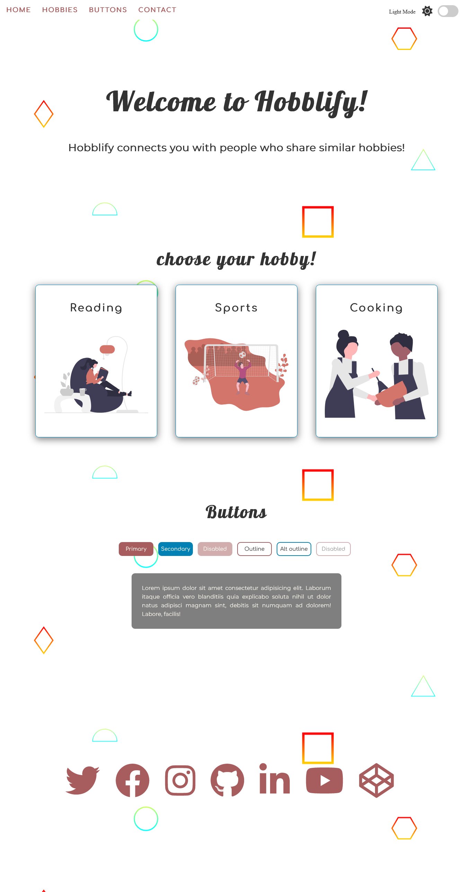
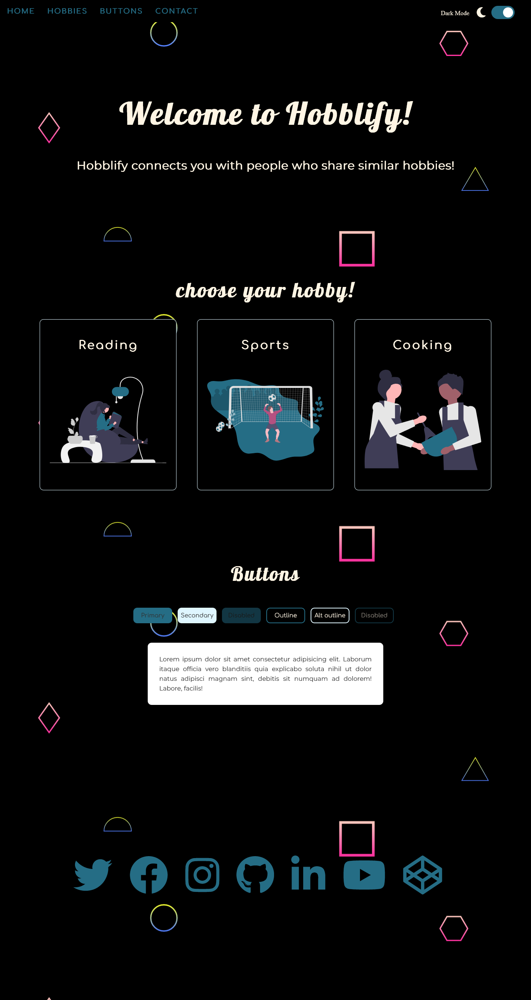

# Light-Dark-Theme
Toggle between light and dark mode

# About
Change the appearance of the web page by clicking on a slider. The slider switches the appearance of the page from light to dark or dark to light.

## Table of contents
  - [Screenshot](#screenshot)
- [My process](#my-process)
  - [Built with](#built-with)
  - [what i learnt](#what-i-learnt)
  - [Useful resources](#useful-resources)
- [Author](#author)
- [Acknowledgement](#acknowledgement)

### Screenshot

## My process
- Create color palettes for both light mode and dark mode and store them in variables to be used through the stylesheet

- Add a 'change' eventListener on the toggle button to listen for when the toggle changes. When a change occurs, a theme change function is called.

-The theme change function takes the change event on the toggle button as an input. The toggle button is essentially a check-box. 
- A condition is set to check if the status of the checkbox is checked, if the condition is true, the documentElement's data theme is set to the dark theme palette created in the stylesheet and the darkMode function is called.

- The darkMode function sets the appearance of some of the elements of the page to match the dark theme by using DOM manipulation methods. Elements such as the Nav-bar, textbox background, and icons are set in this function.

- A light mode function is set to act as the opposite of the darkMode function. This function is called in as the else statement in the condition found in the theme change function

- The imageMode function was created to dynamically set the image sources for the img elements in the body. This was done by using template strings and creating a variable to replace the last word of the file names of each of the image source. This function is then called in both the lightMode and darkMode functions taking the argument of either a string of 'light' or 'dark' as appropriate. This ensures that the filenames are populated dynamically and keeps the code as "DRY" as possible. 

### Built with
- HTML5 
- CSS3 custom properties
- Flexbox
- Javascript

## what i learnt
- The use of Semantic tags such as 'Section'
- importing more than one font type
- New CSS properties animation properties
- Creating a color palette and using a Data theme
- using a backup font type in case the initial font is not supported by user's browser

### Useful resources

- [Undraw website](https://undraw.co/) - Find customizable illustrations for your projects

- [SVG Background](https://www.svgbackgrounds.com/) - Find customizable backgrounds for your projects

- [Google fonts](https://www.fonts.google.com) - Find different fonts for your projects

- [Dark theme design](https://blog.prototypr.io/how-to-design-a-dark-theme-for-your-android-app-3daeb264637) - A guide for dark theme design by [Chethan KVS on Medium](https://kvschethan.medium.com/)

## Author

- Github - [@Kb-Jr](https://github.com/Kb-Jr)
- Twitter - [@Joker__XL](https://www.twitter.com/Joker__XL)

## Attribution
- [SVG Background](https://www.svgbackgrounds.com/)

